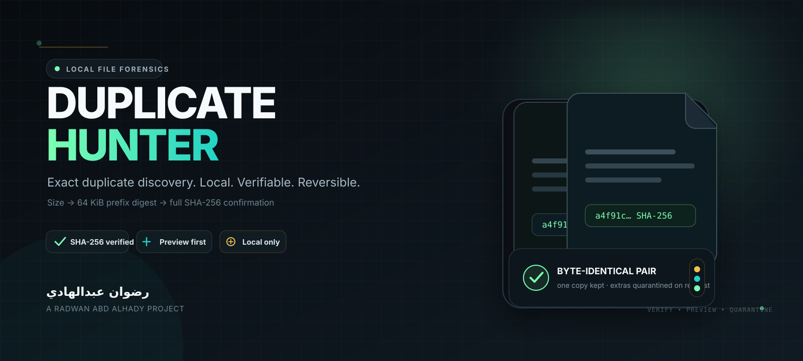

<div align="center">



<br/>


# Duplicate Hunter

**Find byte-identical files with a verification-first workflow — then report or quarantine them without automatic deletion.**

<br/>

[](https://github.com/rad03i2/duplicate-hunter/actions/workflows/ci.yml)


**[English guide](README_EN.md) · [الدليل العربي](README_AR.md) · [Architecture](docs/ARCHITECTURE.md) · [Brand](docs/BRAND.md) · [Security](SECURITY.md)**

</div>

---

> **No filename guessing. No cloud upload. No automatic deletion.**  
> Duplicate Hunter confirms duplicates by content and keeps destructive behavior out of the default workflow.

## What it does

Duplicate Hunter is a compact Python CLI for finding files that are truly byte-identical across one or more files or directories. It reduces unnecessary hashing with a staged pipeline, calculates reclaimable space, can export a JSON audit report, and can move redundant copies into a quarantine directory only after an explicit `--apply`.

<table>
<tr>
<td width="25%"><strong>Content verified</strong><br/><sub>Full SHA-256 confirmation is required before files become a duplicate group.</sub></td>
<td width="25%"><strong>Efficient scan</strong><br/><sub>Files are narrowed by size and a 64 KiB prefix digest before full hashing.</sub></td>
<td width="25%"><strong>Safe action model</strong><br/><sub>Quarantine is preview-only unless <code>--apply</code> is supplied.</sub></td>
<td width="25%"><strong>Local by design</strong><br/><sub>The application contains no network client, account flow, or telemetry path.</sub></td>
</tr>
</table>

## Detection pipeline

```text
files / directories
       │
       ▼
safe traversal
(skip symlinks, unreadable entries,
hidden entries by default)
       │
       ▼
group by exact file size
       │
       ▼
SHA-256 of first 64 KiB
       │
       ▼
full SHA-256 verification
       │
       ▼
byte-identical duplicate groups
       │
       ├── console summary
       ├── JSON audit report
       └── quarantine preview / explicit apply
```

The size and prefix stages are candidate filters only. A group is not reported as duplicate until the candidate files have the same full SHA-256 digest.

## Current capability snapshot

| Area | Supported now |
|---|---|
| Multiple input files/directories | Yes |
| Recursive directory scanning | Yes, by default |
| Non-recursive mode | Yes |
| Hidden files | Excluded by default; opt in with `--include-hidden` |
| Symbolic links | Skipped |
| Hard-link double counting | Avoided during a scan through filesystem identity |
| Minimum file size filter | Yes |
| Full content confirmation | SHA-256 |
| Recoverable-space estimate | Per group and total |
| JSON report | Yes |
| Quarantine preview | Yes |
| Quarantine apply | Explicit `--apply` only |
| Automatic deletion | **No** |
| Automatic restore command | Not currently implemented |
| Similar-image detection | Not implemented |
| Archive inspection | Not implemented |

## Quick start

**Requirement:** Python 3.10 or newer.

```bash
git clone https://github.com/rad03i2/duplicate-hunter.git
cd duplicate-hunter
python -m pip install -e .
duplicate-hunter ~/Downloads
```

Scan multiple locations and ignore files smaller than 1 MiB:

```bash
duplicate-hunter ~/Downloads ~/Pictures --min-size 1048576
```

Create an audit report:

```bash
duplicate-hunter ~/Pictures --json duplicate-report.json
```

Preview a quarantine plan:

```bash
duplicate-hunter ~/Pictures --quarantine ~/DuplicateQuarantine
```

Apply the reviewed plan:

```bash
duplicate-hunter ~/Pictures --quarantine ~/DuplicateQuarantine --apply
```

When applied, extra copies are moved and a `duplicate-hunter-manifest.json` file records their source path, destination path, and SHA-256 digest. One file from each duplicate group is kept.

## CLI options

```text
--no-recursive       inspect only the immediate directory
--include-hidden     include hidden dot-files/directories
--min-size BYTES     ignore files smaller than this size
--json FILE          write a machine-readable JSON report
--quarantine DIR     preview moving redundant copies
--apply              perform the quarantine moves
```

## Safety model

Duplicate Hunter is intentionally conservative around user files:

- duplicate decisions are based on full content hashing, not names;
- symbolic links are skipped;
- unreadable files are skipped rather than treated as duplicates;
- the same underlying hard-linked file is not counted twice during one scan;
- quarantine is a move operation, not deletion;
- action mode requires an explicit `--apply`;
- automatic restore is not claimed — recovery is currently manual using the manifest.

For important data, keep a backup and review the preview before applying moves. Concurrent filesystem changes can still occur between discovery and action. See [SECURITY.md](SECURITY.md) for the exact safety boundary.

## Tests and CI

The repository includes behavioral tests for duplicate detection, hidden/minimum-size filtering, recursion, SHA-256 hashing, human-readable sizing, JSON reporting, preview-only quarantine, and applied quarantine with a manifest.

```bash
python -m pip install -e . pytest ruff
ruff check src tests
pytest
```

GitHub Actions runs linting and tests on:

| OS | Python |
|---|---|
| Ubuntu | 3.10 · 3.12 · 3.13 |
| Windows | 3.10 · 3.12 · 3.13 |
| macOS | 3.10 · 3.12 · 3.13 |

## Project layout

```text
duplicate-hunter/
├── assets/
│   ├── project-cover.svg
│   └── project-logo.svg
├── docs/
│   ├── ARCHITECTURE.md
│   └── BRAND.md
├── src/duplicate_hunter/
│   ├── cli.py
│   └── core.py
├── tests/
│   ├── test_cli.py
│   └── test_core.py
├── .github/
│   ├── ISSUE_TEMPLATE/
│   ├── PULL_REQUEST_TEMPLATE.md
│   └── workflows/ci.yml
├── README_AR.md
├── README_EN.md
├── CHANGELOG.md
├── CONTRIBUTING.md
├── SECURITY.md
└── LICENSE
```

## Documentation

| Document | Purpose |
|---|---|
| [README_EN.md](README_EN.md) | Full English usage guide |
| [README_AR.md](README_AR.md) | الدليل العربي الكامل |
| [docs/ARCHITECTURE.md](docs/ARCHITECTURE.md) | Detection pipeline, components, and safety invariants |
| [docs/BRAND.md](docs/BRAND.md) | Visual identity system and asset usage |
| [SECURITY.md](SECURITY.md) | Filesystem safety and vulnerability reporting |
| [CONTRIBUTING.md](CONTRIBUTING.md) | Contribution and validation workflow |
| [CHANGELOG.md](CHANGELOG.md) | Notable repository changes |
| [LICENSE](LICENSE) | MIT license |

---

<div align="center">

### Built by رضوان عبدالهادي

**Radwan Abd alhady Ahmed · [@rad03i2](https://github.com/rad03i2)**

<sub>Precision duplicate discovery with a local, verifiable, preview-first workflow.</sub>

</div>
