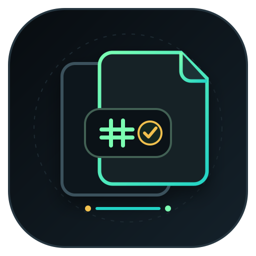

# Duplicate Hunter — English Guide

<p align="center">
  
</p>

Duplicate Hunter is a local Python command-line tool for finding **byte-identical duplicate files**. It verifies content with SHA-256, reports potentially recoverable space, exports JSON for audit or automation, and can move redundant copies into a quarantine folder through an explicit preview/apply workflow.

> Runtime behavior is intentionally conservative: the tool does not auto-delete detected files.

## Requirements

- Python 3.10+
- A filesystem accessible to the current user
- No network service, account, API key, or database

## Installation

```bash
git clone https://github.com/rad03i2/duplicate-hunter.git
cd duplicate-hunter
python -m pip install -e .
```

After installation:

```bash
duplicate-hunter --help
```

## How detection works

Duplicate Hunter reduces unnecessary full-file hashing through three stages:

1. **Exact size** — files of different sizes cannot be byte-identical.
2. **Prefix digest** — candidates of the same size are grouped by SHA-256 of their first 64 KiB.
3. **Full SHA-256** — remaining candidates are fully hashed before a duplicate group is reported.

The prefix digest is only an optimization. Full SHA-256 equality is the final confirmation step used by the application.

During traversal, symbolic links are skipped. Hidden entries are excluded by default. Files that cannot be read are skipped. Files referring to the same underlying filesystem identity are de-duplicated during the scan to avoid counting a hard link as a second physical copy.

## Basic scans

Scan one directory recursively:

```bash
duplicate-hunter ~/Downloads
```

Scan several paths:

```bash
duplicate-hunter ~/Downloads ~/Pictures ~/Documents/archive.zip
```

Only inspect the immediate directory:

```bash
duplicate-hunter ~/Downloads --no-recursive
```

Include hidden entries:

```bash
duplicate-hunter ~/Projects --include-hidden
```

Ignore tiny files, for example anything below 1 MiB:

```bash
duplicate-hunter ~/Pictures --min-size 1048576
```

## Understanding output

Each duplicate group contains:

- the number of matching files;
- each file's size;
- the recoverable bytes represented by extra copies;
- the full SHA-256 digest;
- one `KEEP` entry and the remaining `DUP` entries.

Groups are sorted primarily by recoverable bytes, largest first.

## JSON reports

Write a machine-readable audit report:

```bash
duplicate-hunter ~/Pictures --json duplicate-report.json
```

The report contains a UTC generation timestamp, duplicate groups, individual paths, group hashes and sizes, wasted bytes per group, and the total recoverable byte count.

Representative shape:

```json
{
  "generated_at": "2026-01-01T00:00:00+00:00",
  "groups": [
    {
      "sha256": "<digest>",
      "size": 12345,
      "files": ["<path-a>", "<path-b>"],
      "wasted_bytes": 12345
    }
  ],
  "recoverable_bytes": 12345
}
```

The values above are illustrative only.

## Quarantine workflow

Preview is the default behavior:

```bash
duplicate-hunter ~/Pictures --quarantine ~/DuplicateQuarantine
```

This lists candidates but does not create the quarantine directory and does not move files.

After reviewing the plan, explicitly apply it:

```bash
duplicate-hunter ~/Pictures --quarantine ~/DuplicateQuarantine --apply
```

Applied quarantine behavior:

- one copy from each group is kept;
- extra copies are moved into the quarantine directory;
- name collisions inside the quarantine directory are handled by adding a numeric suffix;
- `duplicate-hunter-manifest.json` records each source path, destination path, and SHA-256 digest.

There is currently no automatic restore command. Use the manifest to restore files manually when needed.

## CLI reference

| Option | Behavior |
|---|---|
| `paths` | One or more files/directories to scan |
| `--no-recursive` | Do not descend into subdirectories |
| `--include-hidden` | Include hidden dot-files/directories |
| `--min-size BYTES` | Ignore smaller files |
| `--json FILE` | Write a JSON report |
| `--quarantine DIR` | Prepare a redundant-copy quarantine plan |
| `--apply` | Perform planned quarantine moves |

A negative `--min-size` value is rejected.

## Privacy and safety

The project has no network client or telemetry code. Hashing and file traversal run locally. A generated JSON report can contain file paths and hashes, so treat reports as potentially sensitive when sharing them.

Duplicate Hunter intentionally does not promise protection against every race condition. Another process can rename, replace, or modify a file between scan and quarantine. Maintain backups for important data and inspect the preview before applying moves.

Read [SECURITY.md](SECURITY.md) for the security policy and [docs/ARCHITECTURE.md](docs/ARCHITECTURE.md) for implementation boundaries.

## Development

Install the project plus the test/lint tools:

```bash
python -m pip install -e . pytest ruff
```

Run validation:

```bash
ruff check src tests
pytest
```

CI runs the same lint/test flow on Ubuntu, Windows, and macOS with Python 3.10, 3.12, and 3.13.

## Scope boundaries

Duplicate Hunter currently does **not**:

- compare images by visual similarity;
- inspect archive contents;
- deduplicate by filename or timestamps;
- automatically restore quarantined files;
- delete duplicate files automatically;
- provide a graphical interface.

These are boundaries of the current version, not implied features.

## License and author

MIT License — see [LICENSE](LICENSE).

**Radwan Abd alhady Ahmed**  
**رضوان عبدالهادي**  
GitHub: [@rad03i2](https://github.com/rad03i2)
